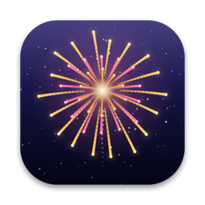
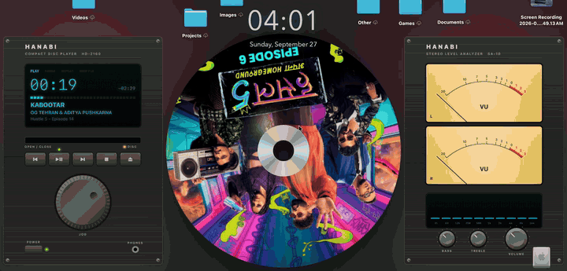
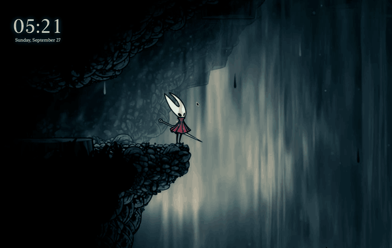
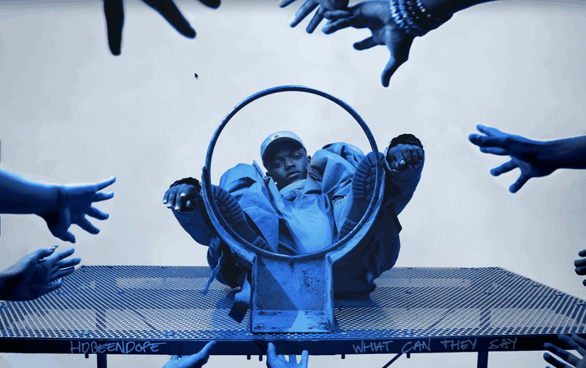
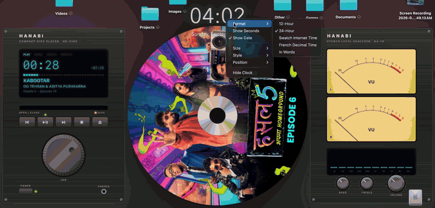
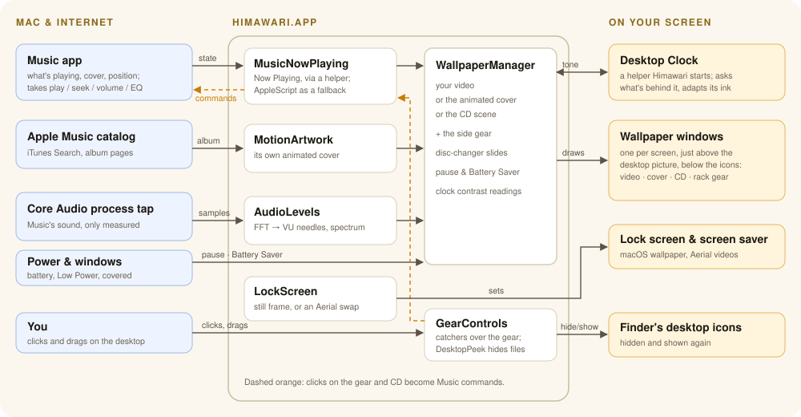
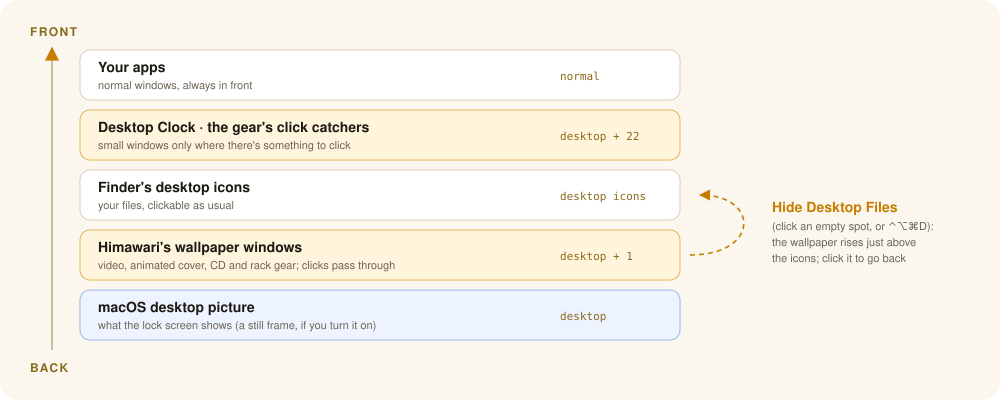

<p align="center">
  
</p>

<h1 align="center">Himawari</h1>

<p align="center">
  A live video wallpaper for macOS that turns into your music: Apple Music's animated album art,<br>
  retro hi-fi gear that follows the song, and a spinning CD for everything else.
</p>

<p align="center">
  <a href="https://github.com/dhairyab0069/himawari-mac/releases/latest/download/Himawari-1.1.2.dmg"><b>⬇︎ Download Himawari Beta 1.1.2 (DMG)</b></a>
  &nbsp;·&nbsp; macOS 14.4 or later &nbsp;·&nbsp; Apple Silicon and Intel
</p>

<p align="center">
  
</p>

<p align="center">
  <a href="https://dhairyab0069.github.io/himawari-io/">Project page</a> &nbsp;·&nbsp;
  <a href="https://github.com/dhairyab0069/himawari-io/releases">All downloads</a>
</p>

---

## Contents

- [Features](#features)
- [Install](#install)
- [Using Himawari](#using-himawari)
  - [Your wallpaper](#your-wallpaper)
  - [The music wallpaper](#the-music-wallpaper)
  - [Hide the desktop's files](#hide-the-desktops-files)
  - [The desktop clock](#the-desktop-clock)
- [Permissions](#permissions)
- [Battery](#battery)
- [How it works](#how-it-works)
- [Building from source](#building-from-source)
- [Project layout](#project-layout)
- [Weekly maintenance bot](#weekly-maintenance-bot)
- [Privacy](#privacy)
- [AI assistance](#ai-assistance)
- [Acknowledgements](#acknowledgements)
- [Roadmap](#roadmap)

## Features

| | |
|---|---|
| **Live wallpaper** | Any `.mp4` / `.mov` as your wallpaper, filling the screen. Pauses when covered, locked, asleep or on battery. |
| **Apple Music artwork** | While a song plays, the album's animated cover becomes the wallpaper, shown whole, never cropped. |
| **Retro hi-fi side gear** | Beside the artwork: a CD deck (fluorescent display, time, progress, transport, jog wheel) and a stereo analyzer whose VU needles and spectrum follow the actual music. |
| **Spinning CD** | Songs without an animation get their cover wrapped onto a spinning CD, with a disc-changer transition between songs and little characters running along the bottom. |
| **Click to hide files** | Click an empty spot on the desktop to see just the wallpaper; click again to bring the files back. |
| **Desktop clock** | A big see-through clock that ticks with the system clock and adapts to what's behind it. Click it to change how it tells the time. |

## Install

1. [Download the DMG](https://github.com/dhairyab0069/himawari-mac/releases/latest/download/Himawari-1.1.2.dmg) and open it.
2. Drag **Himawari** onto **Applications**, then open it from Applications.
3. The first time, macOS may say it can't check Himawari for malicious software: Himawari isn't notarized
   (that needs a paid Apple Developer ID). Either right-click Himawari ▸ **Open** ▸ **Open**, or go to
   **System Settings ▸ Privacy & Security** and click **Open Anyway**.

Himawari lives in the menu bar (the sunflower icon). To uninstall, quit Himawari and move it to the Trash.

Downloads are also on the [project page](https://dhairyab0069.github.io/himawari-io/).

## Using Himawari

Everything is in the menu-bar icon's menu.

### Your wallpaper

<p align="center"></p>

| Menu item | What it does |
|---|---|
| **Choose Video…** | Picks the wallpaper video. It always fills the whole screen. |
| **Pause / Resume**, **Mute**, **Volume** | Playback controls. Wallpapers are muted by default. |
| **Pause When Desktop Is Covered** | Stops decoding video nobody can see. |
| **Pause on Battery** | Pauses the wallpaper on battery power. |
| **Show Desktop Clock** (⌃⌥⌘C) | Shows or hides the desktop clock. |
| **Moving Lock Screen** | Off by default. Your video, moving, on the lock screen and as the screen saver: macOS only moves its Aerial wallpapers there, so Himawari swaps the video of the Aerials you've picked in System Settings ▸ Wallpaper for yours, converted to exactly Apple's format (4K HEVC, 10-bit, 240 fps, each Aerial's length). Converting takes about 5× the Aerial's length, once per video. Apple's originals are kept and restored when it's off; if macOS restores one, it's swapped again. macOS still decides when the lock screen moves (on battery it may pause). |
| **Show Wallpaper on Lock Screen (Still)** | Off by default. macOS doesn't let apps draw on the lock screen, so Himawari sets a still frame of your video as the macOS wallpaper picture, which the lock and login screens show. It updates when you choose a new video; turning it off puts your previous picture back. |
| **Show in Dock**, **Launch at Login** | Where and when Himawari appears. |

Himawari never keeps your Mac awake. `.webm` files won't play; convert them with
`ffmpeg -i in.webm -c:v h264_videotoolbox -b:v 8M -an out.mp4`.

### The music wallpaper

<p align="center"></p>

Turn on **Use Apple Music Artwork While Playing**. While a song plays in Music:

- **Albums with an animated cover:** the animation becomes the wallpaper, shown whole and kept below
  the notch, streamed at the sharpest size your screen can show (up to 2160×2160). The bars at its
  sides become **retro hi-fi gear in a rack**:
  - *CD deck* (left): a cyan fluorescent display with PLAY / PAUSE / REPEAT / SHUFFLE, elapsed and remaining time, a
    segmented progress ladder, and the song, artist and album (long titles scroll); a disc tray,
    transport buttons, and a jog wheel that turns while playing.
  - *Stereo analyzer* (right): two amber-lit analog VU meters and a 10-band spectrum display that move
    with the actual music, plus bass, treble and volume knobs.
  - **It's playable:** the transport buttons play, pause, skip and go back in Music (eject opens Music);
    click the progress ladder to jump there; turn the jog wheel to scrub (clockwise is forward, a full
    turn is 10 s); drag the VOLUME knob up or down for Music's volume. Drag BASS and TREBLE for
    ±12 dB of low and high shelf on Music's equalizer (a "Himawari" preset; double-click a knob for
    flat, and with both back at 0 your own equalizer setting returns). Click REPEAT or SHUFFLE on the
    display to switch them; they also light up to show what Music is set to.
- **Albums without one:** the cover is printed on a **spinning CD**, like a real picture disc, with a
  see-through center hole, a silver ring and a soft rainbow luster. The same side gear sits beside it.
  **Grab the CD and turn it** like a record to scrub through the song (a full turn is 8 seconds), with the
  soft sound of a disc being turned. Changing songs works like a disc changer: the old CD slides off the left of the screen and the new
  one comes in from the right, spinning up as it settles. Going back (Previous) runs it the other way,
  the last disc returning from the left with a little rewind. When the next song has Apple Music's
  animation (or the music stops), the CD slides away and the scene fades into what's next.
- **…or a YouTube Loop of the Song** (off by default): instead of the CD, the song's music video from
  YouTube's embedded player, kept in step with the song.
- **Pausing** the song brings your own wallpaper back.

**Music Video Sizing ▸** sets how the music wallpaper fits: *Widescreen* (the default: whole video, bars
where needed), *Show Whole Video*, *Fit Width*, *Fill Screen*, and **Fill Gaps With ▸** *Soft Colors*
(a slow glow in the video's own edge colors, the default), *Blurred Video* or *Black Bars*.

### Hide the desktop's files

With **Click Desktop to Hide Files** on (the default), click an empty spot on the desktop: the files
and folders disappear and it's just the wallpaper, music playing or not. Click the wallpaper again to
bring them back. Clicks on files, selection rectangles and double-clicks work as usual. You can also use
**Hide Desktop Files** in the menu, or **⌃⌥⌘D** from anywhere.

### The desktop clock

<p align="center"></p>

A big see-through clock on the desktop, running with Himawari (it's a small helper app inside
Himawari.app). **Left-click** cycles 12-hour → 24-hour → Swatch Internet Time (.beats) → French
decimal time → in words ("quarter past six"). **Right-click** for format, seconds, date, size, style
(Aero glass, fluorescent display, rounded, serif), position, or Hide. Hidden, it comes back with
**⌃⌥⌘C** from anywhere, or **Himawari menu ▸ Show Desktop Clock**. It ticks exactly with the system
clock, and its text adapts to whatever is behind it: the clock tells Himawari where it sits, and
Himawari measures exactly that spot of the wallpaper.

## Permissions

macOS asks once for each of these, the first time it's needed.

| App | Permission | Why |
|---|---|---|
| Himawari | **Automation ▸ Music** | Reads what's playing and the album cover. |
| Himawari | **Automation ▸ Finder** | Checks whether a desktop click landed on a file (click to hide files). |
| Himawari | **System Audio Recording Only** | Measures the music's loudness for the VU meters. Nothing is recorded; decline and the meters animate on their own. |

Missed a prompt? Turn it on in **System Settings ▸ Privacy & Security**, then quit and reopen the app.

## Battery

Battery Saver turns on by itself on battery or in Low Power Mode:

- The wallpaper pauses while windows cover most of the screen (only with **Pause When Desktop Is Covered** on), and music artwork streams at 1080p.
- YouTube loops and the blurred fill are skipped; the side gear's motion, the CD's runners and the
  luster's drift rest (changing discs still slides: it's a one-second animation).
- Background checks run half as often.

Always, regardless of power: a muted wallpaper never decodes its audio; the side gear and its audio
measuring run only while you can see the desktop and a song is playing; animations run at low frame
rates in the window server. Himawari idles at well under 1% CPU.

## How it works

<p align="center"></p>

<p align="center"></p>

- **Song timing** comes from the system's Now Playing state (what Control Center shows), pushed the
  instant you play, pause, seek or skip, within about 0.05 s of Music. macOS lets only Apple's own
  programs read it, so a tiny bundled helper (`helpers/NowPlayingHelper.m`) runs inside Apple's
  `/usr/bin/perl`, which may. This is unofficial: if a macOS update closes that door, Himawari falls
  back to asking Music over AppleScript.
- **Covers** come from the system's Now Playing too: the exact artwork Music shows, sharpened to
  1200×1200 from Apple's image server for streamed songs (which have no artwork over AppleScript).
  Music itself, then the iTunes Search API, are the fallbacks.
- **Motion artwork:** Apple's public iTunes Search API finds the album, and its public Apple Music
  page lists the looping video. That page isn't an official API, so if Apple changes it you get the CD.
- **VU meters and spectrum:** a Core Audio process tap on Music, measured (never saved) with an FFT.
- **The CD print:** like a real printed disc, the cover is laid flat across the CD, cut to its circle
  around the silver ring, with the pressed data tracks showing faintly through the ink. Like a disc
  designer, Himawari measures where the cover's detail is (text, faces) and slides or slightly enlarges
  the art so the center ring lands on a calm spot. It's made on all cores in about 10 ms, once per cover.
- **Clock contrast:** the desktop clock tells Himawari where it sits; Himawari measures exactly what's
  behind it (video, bars, CD, or a YouTube thumbnail) and answers, again whenever that changes.
- **YouTube** plays in YouTube's own embedded player; nothing is downloaded.

## Building from source

Requires Xcode (Swift 5.10 or later) on macOS 14.4 or later.

```bash
./install.sh          # build, then install / update /Applications/Himawari.app
scripts/make_dmg.sh   # build the shareable DMG → build/Himawari-<version>.dmg (universal)
```

Builds are signed with a local identity (`tools/make_signing_identity.sh`) so the permissions you
grant survive rebuilds.

Logs: `~/Library/Logs/Himawari.log`.

## Project layout

| Path | Contents |
|---|---|
| `Sources/Himawari/` | The wallpaper app. `ClockHelper` (runs the desktop clock), `GearControls` (the playable gear and CD), `LockScreen` + `MovingLockScreen`, `WallpaperManager` (what's on the wallpaper, and when), `VideoCanvas` (one screen's video and its bars), `MusicScene` + `DiscPrint` (the CD), `NowPlayingSides` (the side gear), `AudioLevels` (the audio tap), `ToneReporter` (clock contrast), `DesktopPeek` (click to hide files), `PlaybackMonitor` (pause rules), `AppDelegate` (menus), `Settings`, `Log`. |
| `Sources/HimawariKit/` | Shared code: `Settings` (one preferences domain plus a change broadcast), `NowPlaying` + `SystemNowPlaying` (Apple Music), `WallpaperTone` (brightness readings), `DesktopLayout` (the tiling map), `DesktopWindow` (desktop-level windows), `PowerState`, `AeroStyle`. |
| `Sources/HimawariClock/` | The desktop clock (a helper app inside Himawari.app). |
| `helpers/NowPlayingHelper.m` | The system Now Playing stream. |
| `scripts/` | `make_dmg.sh`. |
| `tools/` | The app icon and the signing identity. |
| `maintenance/` | The weekly bot. |

Window layers, counted up from the system wallpaper: video +1, Finder's icons +20, the clock and the
gear's click catchers +22; app windows above those (see the diagram above).

## Weekly maintenance bot

Every **Monday at 2 PM** (or at the next wake), `launchd` runs `maintenance/weekly.sh`:

1. Skips the run if there are uncommitted changes.
2. Updates Homebrew and everything it installed (including Ghostty), and the Rust toolchain.
3. Claude Code fixes only what a new macOS or Swift broke (`maintenance/prompt.md`), capped at $2.
4. Rebuilds. If the build passes and code changed, it commits and runs `./install.sh`; if it fails,
   it rolls everything back.
5. Sends a notification. Logs go to `maintenance/logs/`.

| To | Run |
|---|---|
| Run it now | `maintenance/weekly.sh` |
| Test without Claude or updates | `maintenance/weekly.sh --dry-run` |
| See what it changed | `git log -p` |
| Undo its last change | `git revert HEAD && ./install.sh` |
| Turn it off | `launchctl bootout gui/$(id -u) ~/Library/LaunchAgents/local.dhairyabhatia.hanabi-maintenance.plist` |

## Privacy

Himawari has no accounts, analytics or telemetry, and uploads nothing about you. It connects only to:

| To | When | For |
|---|---|---|
| `itunes.apple.com` (iTunes Search API) | A song starts | Finding the album, to look for its animated cover |
| `music.apple.com` (public album pages) | A song starts | The animated cover's video address |
| `*.mzstatic.com` (Apple's image and video servers) | A song starts | The cover in full resolution; the animated cover itself |
| `youtube.com`, `i.ytimg.com` | Only with **…or a YouTube Loop of the Song** on | Finding and playing the music video, in YouTube's embedded player |

With **Show Wallpaper on Lock Screen** on, Himawari changes your macOS wallpaper picture (to a frame of your video, kept in `~/Library/Application Support/Himawari`) and remembers the one you had.

On your Mac: the audio tap measures loudness and never records or saves sound; the Finder check reads
only how many items are selected; logs stay in `~/Library/Logs`.

## AI assistance

Himawari was built with **[Claude Code](https://claude.com/claude-code)**, Anthropic's AI coding
assistant, as a pair programmer.

- **Who did what.** The author decided what to build and how it should look and behave, tried every
  change on their own Mac, and reported what was wrong (often with screenshots). Claude wrote most
  of the code, built and installed it, and tracked down problems from logs, crash reports and
  measurements.
- **How changes were checked.** Every change was compiled and installed, then verified where it
  runs: logs, crash reports, CPU and memory use, timing measured against Music, and rendered
  screenshots of the scenes. Bugs found this way were fixed and re-checked, not assumed fixed.
- **Assume it's assisted.** The history is collapsed into one commit per release, so there
  are no per-commit AI labels: treat all of the code as written with AI help.
- **Know the limits.** This is a tested personal project, not an audited product. Code written with
  an AI can be wrong in ways testing on one Mac doesn't catch. Two features rely on unofficial,
  undocumented Apple behavior (the system Now Playing workaround and Apple Music's album pages)
  and are labelled as such above; either may stop working after a macOS update.
- **The weekly bot** (below) also uses Claude Code, with guardrails: it skips the run if there are
  uncommitted changes; it may only read and edit this folder, run `swift build` and read git; it is
  capped at $2 a run; it rolls everything back if the build fails; it commits locally and never
  pushes. Every change it makes shows in `git log -p` and can be reverted.
- **What reaches the AI.** The app itself never sends anything to an AI service. Development
  sessions and the weekly bot send this repository's source code to Anthropic.

## Acknowledgements

- **[Hanabi for GNOME](https://github.com/jeffshee/gnome-ext-hanabi)** by Jeff Shee, the live video
  wallpaper extension for GNOME, was the starting point and inspiration for this project, and gave
  it its first name. The core idea (a video as your live wallpaper) and several of its choices come
  from it: mute and volume, pausing when the desktop is covered, pausing on battery. Himawari is a
  separate implementation for macOS, written from scratch in Swift: only the extension's README was
  read, for its feature list, and none of its (GPL-3.0) source code was used or adapted. A line-by-line
  comparison of the two codebases finds nothing shared beyond the standard XML header. Thank you!
- Running the Now Playing helper inside Apple's `/usr/bin/perl` follows the approach of
  [mediaremote-adapter](https://github.com/ungive/mediaremote-adapter).
- Apple's frameworks (AVFoundation, Core Animation, Core Audio process taps, SwiftUI) do the heavy
  lifting; Apple Music provides the animated covers.

## Roadmap

See [ROADMAP.md](ROADMAP.md).

---

<p align="center"><sub>Himawari (ひまわり) is Japanese for sunflower. Formerly called Hanabi, after
<a href="https://github.com/jeffshee/gnome-ext-hanabi">Hanabi for GNOME</a>, which it began from.</sub></p>
